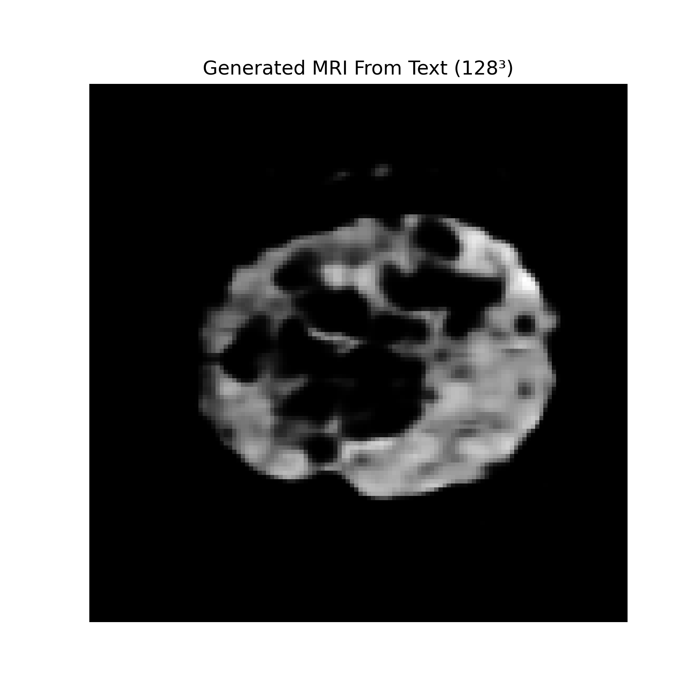

# Text-to-MRI Generation using BERT + 3D CNN

This project generates synthetic 3D brain MRI volumes from radiological text descriptions. You give it a clinical finding like "mass-like signal in the left frontal lobe with strong enhancement" and it outputs a 128x128x128 NIfTI volume.

Built on the BraTS Meningioma dataset. Trained on a remote Linux server over SSH using a conda environment.

---

## Dataset

This project uses two data sources that need to be downloaded separately and placed in the same folder.

### 1. Text Data (Radiology Reports) — HuggingFace
Download from: https://huggingface.co/datasets/JiayuLei/RadGenome-Brain_MRI/tree/main

- Download the `global_finding.json` file from the HuggingFace repository
- This file contains case IDs mapped to radiology report strings

### 2. MRI Data — BraTS 2024 Meningioma
Download from: https://www.synapse.org/ (requires free account and data access request)

- Download the BraTS 2024 Meningioma segmentation dataset
- Extract the NIfTI (.nii.gz) files

### Folder Structure
After downloading both, organize your data like this:
```
~/data/BraTS_MEN/
    images/
        BraTS-MEN-00001-t2f.nii.gz
        BraTS-MEN-00002-t2f.nii.gz
        ...
    global_finding.json
```

The dataset class matches each case ID in `global_finding.json` to its corresponding MRI file in the `images/` folder.

---

## How it works

- **Text encoder**: BERT (bert-base-uncased) frozen, using the CLS token embedding
- **Decoder**: 4-stage 3D transposed convolution network, 8 cube up to 128 cube
- **Loss**: L1 + gradient edge loss weighted at 0.5
- **Output**: .nii.gz volume + 2D middle-slice PNG

---

## Function Structure

| Function / Class | Description |
|---|---|
| `BraTSTextMRIDataset` | Loads and pairs radiology text reports with their corresponding MRI volumes, tokenizes text using BERT tokenizer, and normalizes image intensity to [0,1] |
| `BraTSTextMRIDataset.__getitem__` | Returns a single (input_ids, image_tensor) pair for a given index |
| `gradient_loss` | Computes edge-aware loss by comparing spatial gradients of predicted and target volumes in all three directions (x, y, z) to preserve structural boundaries |
| `TextToMRIModel.__init__` | Defines the full model architecture including the frozen BERT encoder, a fully connected projection layer, and the 3D transposed convolution decoder |
| `TextToMRIModel.forward` | Encodes input text tokens into a BERT CLS embedding, projects it to a latent 3D cube, and decodes it into a 128x128x128 MRI volume |
| `main` | Sets up the dataset, dataloader, model, optimizer, and runs the full training loop for 200 epochs, saving the best checkpoint |

---

## Setup
```bash
conda create -n text2mri python=3.10
conda activate text2mri
pip install -r requirements.txt
```

---

## Training
```bash
python train_ddp.py
```

Saves best checkpoint to `text_to_mri_model_128.pth`. Ran 200 epochs, logs every 10 batches.

Trained on a remote Debian server over SSH via ngrok:
```bash
ssh -p 13293 craft-guest@4.tcp.ngrok.io
. ~/miniconda3/etc/profile.d/conda.sh
conda activate text2mri
python train_ddp.py
```

---

## Inference

Edit the `text` variable in `inference.py` then run:
```bash
python inference.py
```

Outputs:
- `generated_128.png` — middle axial slice
- `generated_128_volume.nii.gz` — full 3D NIfTI volume

---

## Result



---

## Files

| File | Description |
|------|-------------|
| `train_ddp.py` | Dataset, model definition, training loop |
| `inference.py` | Load checkpoint, generate MRI volume from text |
| `requirements.txt` | Python dependencies |
